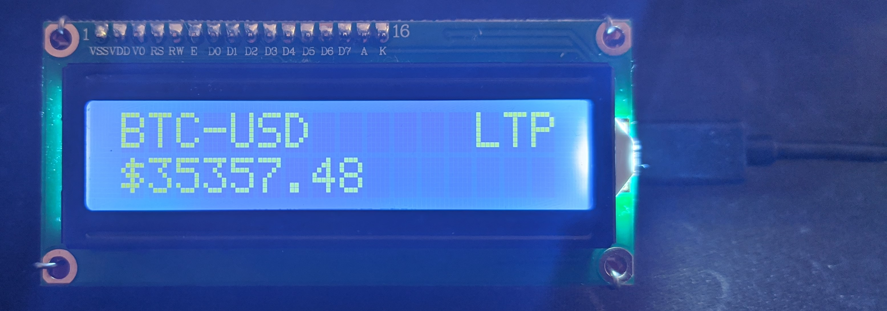
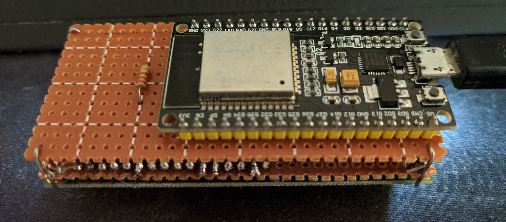

# Stock-Displayer
A physical device that updates the price of a stock frequently

## Hardware used
1. ESP32
2. 16x2 LCD
3. 2.2k Ohm Resistor for the LCD contrast

## Setup
1. Download and install the PlatformIO extension on VSCode
2. Import the files
3. Write your wifi name and password in the source code and change the display settings if needed 
4. Flash to the device

